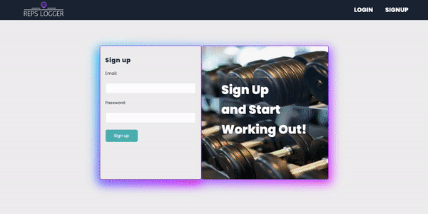

# Reps Logger | Full Stack Workout Tracker

## Built with MongoDB, Express, React, and Node (MERN Stack)

<!-- **Link to project: [Live-demo]https://next-shoecommerce.netlify.app** -->

---

## **How It's Made:**

---

### I started this workout tracker app by building out the backend API before the frontend. I used Node.js, Express, and MongoDB to build out a backend for the application that would allow users to create an account with login/signup options using bcrypt and JSON web tokens. Once a user is authorized and logged in, then the user would have access to the workouts route of the API, which allows the user to create new workouts and store them in a database to view at a later time with a timestamp for workout completed. I then built out a React frontend to interact with the backend API and allows users a UI to interact with. I used Context API to manage the Authorization state(login/signup) and the Workout state with dispatch functions to make changes to global state. I have implemented a couple of modals for users. One of which appears if a user clicks on the user avatar picture, which will allow the user to change avatar picture to one of the preset options. The other modal in the UI would be a weight lifted in the last 24 hours modal, which calculated weight lifted and then gives you an unusual unit of measurement to compare weight lifted to, such as amount of elephants lifted, motorcycles, etc. Many of these calculations/operations were accomplished with React hooks, such as useState and useEffect.

---

## **Tech used:**

---

### HTML, Tailwind CSS, Javascript, React JS, MongoDB, Express, Node
